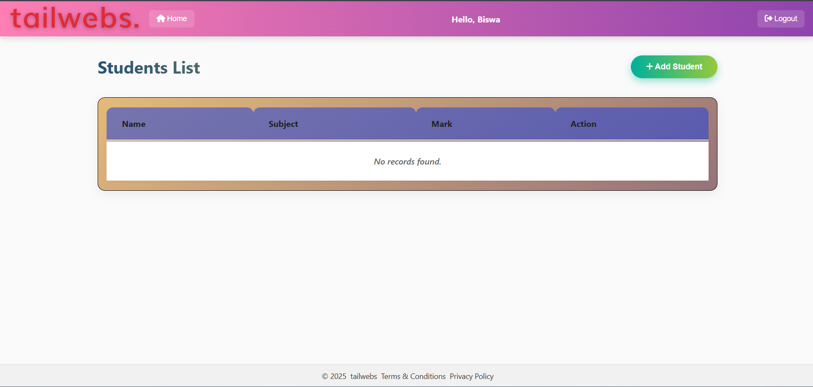
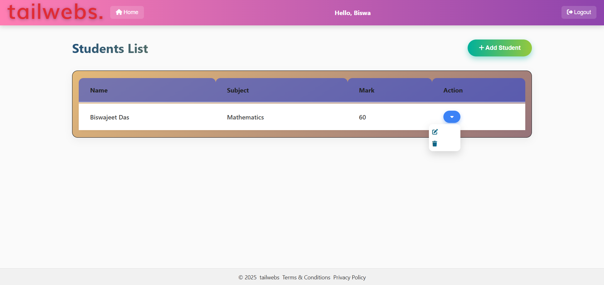
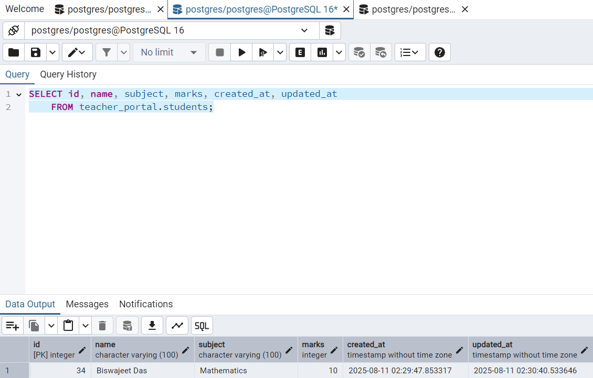

# Teacher Portal Project

A secure, logic-driven teacher portal built with **Django** and **PostgreSQL**.  
Teachers can log in, manage students (add, edit, delete), and track changes with an audit log.

---

## **Setup Instructions**

### 1. Clone Repository
```bash
git clone https://github.com/yourusername/teacher_portal.git
cd teacher_portal
```

### 2. Create & Activate Virtual Environment
```bash
python -m venv venv
venv\Scripts\activate   # Windows
# or
source venv/bin/activate  # Mac/Linux
```

### 3. Install Dependencies
```bash
pip install -r requirements.txt
```

### 4. Configure PostgreSQL Database

#### Create Schema & Tables
Run the following SQL in your PostgreSQL client (e.g., `psql`):
```sql
CREATE SCHEMA teacher_portal;

CREATE TABLE teacher_portal.teachers (
    id SERIAL PRIMARY KEY,
    username VARCHAR(50) UNIQUE NOT NULL,
    password_hash TEXT NOT NULL,
    salt TEXT NOT NULL,
    created_at TIMESTAMP DEFAULT CURRENT_TIMESTAMP
);

CREATE TABLE teacher_portal.students (
    id SERIAL PRIMARY KEY,
    name VARCHAR(100) NOT NULL,
    subject VARCHAR(100) NOT NULL,
    marks INTEGER NOT NULL CHECK (marks >= 0 AND marks <= 100),
    created_at TIMESTAMP DEFAULT CURRENT_TIMESTAMP,
    updated_at TIMESTAMP DEFAULT CURRENT_TIMESTAMP
);

CREATE UNIQUE INDEX idx_students_name_subject 
ON teacher_portal.students(name, subject);

CREATE TABLE teacher_portal.audit_log (
    id SERIAL PRIMARY KEY,
    teacher_id INTEGER NOT NULL REFERENCES teacher_portal.teachers(id) ON DELETE CASCADE,
    student_id INTEGER NOT NULL REFERENCES teacher_portal.students(id) ON DELETE CASCADE,
    action VARCHAR(20) NOT NULL, -- e.g., 'update', 'delete'
    old_marks INTEGER,
    new_marks INTEGER,
    timestamp TIMESTAMP DEFAULT CURRENT_TIMESTAMP
);
```

#### Create `.env` File
In the project root, create a `.env` file:
```
DB_NAME=postgres
DB_USER=postgres
DB_PASS=your_password
DB_HOST=localhost
DB_PORT=5432
SECRET_KEY=your_django_secret_key
```

### 5. Run Migrations
```bash
python manage.py makemigrations
python manage.py migrate
```

### 6. Run the Server
```bash
python manage.py runserver
```

### 7. Access the App
Open in browser: [http://127.0.0.1:8000](http://127.0.0.1:8000)

---

## **Features**
- **Custom Authentication**  
  - Manual password hashing with salt (no Django auth library)
  - Secure session tokens stored in memory
- **Student Management**  
  - Add new students via modal
  - Prevent duplicate name+subject entries
  - Automatically update marks if student exists
  - Edit marks inline with validation (0–100)
  - Delete student records
- **Audit Logging**  
  - Logs every update/delete with timestamp, teacher info, old & new marks
- **Security**  
  - CSRF protection
  - XSS prevention with HTML escaping
  - SQL injection protection via ORM & parameterized queries

---

## **Security Considerations**
- **Passwords** stored as salted hashes (never in plain text).
- **Session Tokens** generated using `secrets.token_hex()` and stored in-memory for demo.
- **CSRF Protection** enabled with `` and Django middleware.
- **XSS Prevention** by escaping all user input in templates (`|escape`).
- **Validation** on both client & server side for marks range (0–100).

---

## **Challenges Faced**
- Implementing secure custom authentication without Django's built-in auth.
- Handling duplicate student entries with automatic mark merging.
- Managing inline edit & delete with AJAX.
- Maintaining audit logs with proper references to teacher and student IDs.

---

## **Approximate Time Taken**
**8–10 hours** including:
- Project setup & database modeling
- Custom authentication
- Building frontend for inline edits & modal forms
- Writing secure backend logic
- Testing & debugging

---


## **.gitignore**
```gitignore
venv/
__pycache__/
*.pyc
db.sqlite3
.env
```

---

## 📸 Screenshots

### 1️⃣ Login Page


### 2️⃣ Dashboard


### 3️⃣ Add Student


### 4️⃣ After Adding – Action Buttons


### 5️⃣ Edit Student Data


### 6️⃣ Teachers Table (PostgreSQL)


### 7️⃣ Students Table (PostgreSQL)


### 8️⃣ Audit Log Table (PostgreSQL)


---


## **Author**
Developed by **Biswajeet Das** ✨ 
